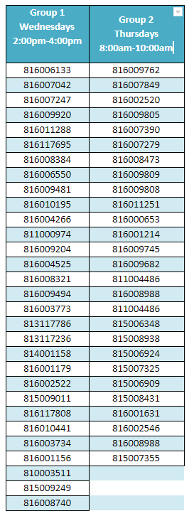

# Course Info
- Lecturer: Dr. Phaedra Mohammed
- Lecturer Contact: phaedra.mohammed@my.uwi.edu
- Tutor: Nicholas Mendez
- Tutor Contact: info26603uwi@gmail.com
- [Course Outline](files/outline.pdf)

# Anouncements
## Lab Assignments

# Course Content

##  Week 1:
#### Introduction

- [Lecture 1](files/lecture1.pdf)
- [Worksheet 1](files/WS1.pdf)

##  Week 2:
#### Computer Architecture and Organization

- [Lecture 2](files/lecture2.pdf)
- [Lecture 3](files/lecture3.pdf)
- [Lecture 4](files/lecture4.pdf)
- [Lab 1](files/lab1.pdf)
